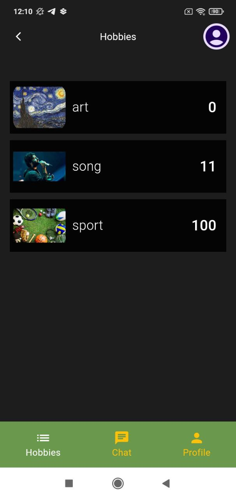
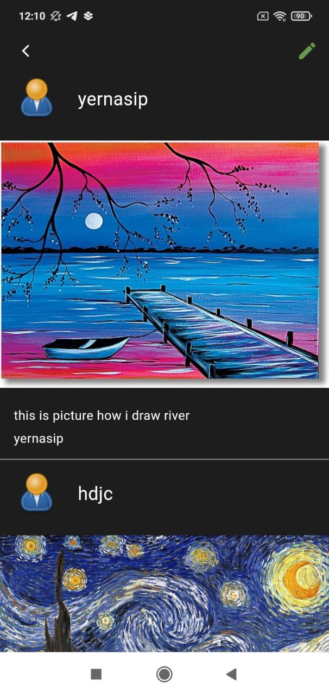
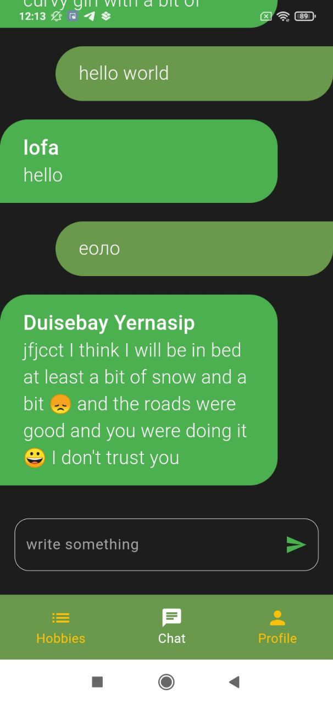
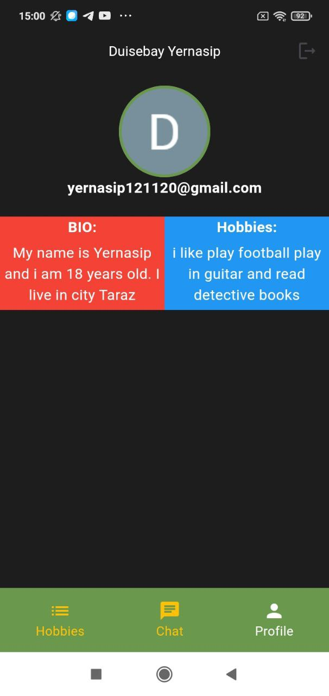
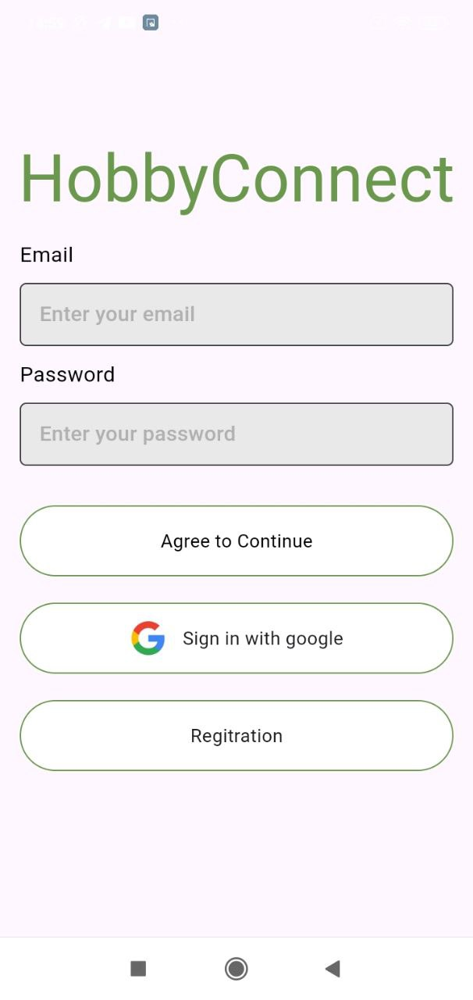

# 📱 My Flutter App

Welcome to **My Flutter App**! This app is built with **Flutter** and demonstrates modern app design and development.

---

## 🌟 Features
- 🚀 **Feature 1**: Firebase
- 📷 **Feature 2**: Flutter
- 🛠️ **Feature 3**: Firebase

---

## 📸 Screenshots

| Home Screen | News Screen | Chat Screen |
|-------------|----------------|-----------------|
|  |  |  |

| Profile | Chat |
|---------------|------|
|  |  |

---

## 🚀 Getting Started


### Installation
1. Clone the repository:
   ```bash
   git clone https://github.com/mynameisYera/hobby_connect.git
